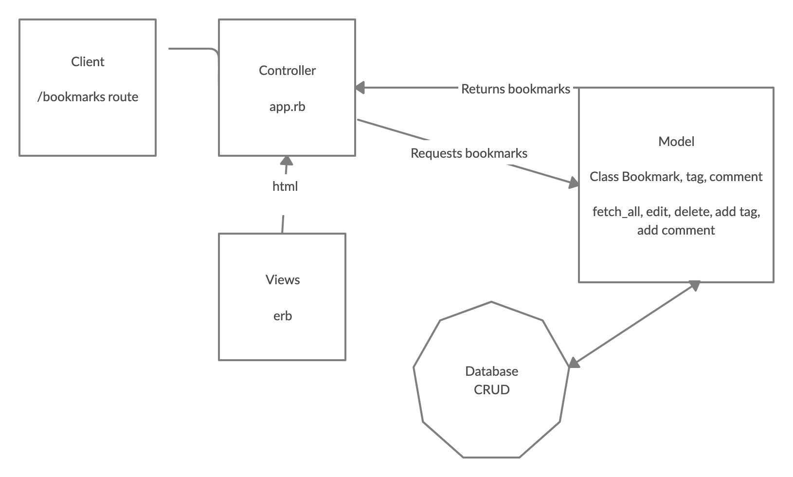

# Bookmarks

## User Stories

```
As a user
So I can remember a website that I like
I want to be able to add it in my bookmarks

As a user
So I can view my saved websites
I want to be able to view my list of bookmarks

As a user
So I can manage my list of bookmarks
I want to be able to delete old bookmarks

As a user
So I can manage my list of bookmarks
I want to be able to edit a saved bookmark

As a user
So I can organise my bookmarks
I want to be able to add comments to a bookmark

As a user
So I can organise my bookmarks into categories
I want to be able to add a tag to a bookmark

As a user
So I can search through my bookmarks
I want to be able to  filter through my bookmarks via tag

As a user
So my bookmarks are secure
I don’t want anyone else to be able to manage my bookmarks
```

## Domain Model

| Possible Objects            | Methods        |
| ----------------------------|:-------------: |
| Bookmark                    | view, add, del |
| Tag                         | add_tag        |
| Comment                     | add_comment    |
| User account                | login          |


